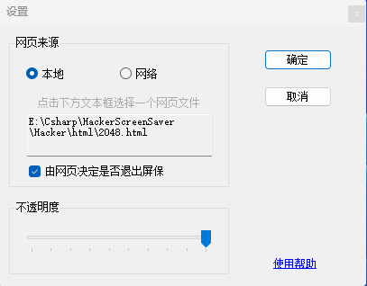
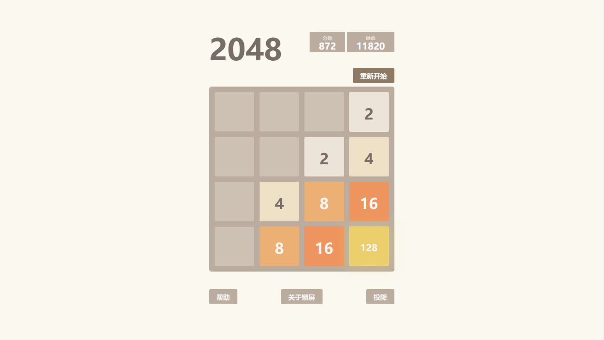

# HackerScreen for windows

.NET develops a screen saver. 

Hacker Screen Saver 是一款 .NET 设计的屏幕保护程序，可以显示 HTML 页面，你可以将黑客模拟器的网页，摸鱼时需要的windows更新，或者爱心代码网页设置为你的 Windows 电脑屏保。

软件代码介绍的相关文章：

- [《用.NET设计一个假装黑客的屏幕保护程序》](https://mp.weixin.qq.com/s/WAsWQINJA3cletktYb-TKw)
- [《退出屏保前玩一把游戏吧！webBrowser中网页如何调用.NET方法》](https://mp.weixin.qq.com/s/-_deEGlMrAPenCFWIG8ORg)

已添加设置功能，可以选择本地网页也可以设置自定义的 URL 地址。软件自身提供 四 个网页屏保。

[👉 点击下载最新 v1.6 版](https://github.com/sangyuxiaowu/HackerScreenSaver/releases/download/v1.6/HackerScreenSaver.zip)

# 使用介绍

软件超轻量不足 1MB 大小，无需安装。下载解压软件，将其放到任意位置留存即可。

右键点击 `Hacker.scr` 选择 `安装`


在下方界面设置好等待时间，点击确定即可。


若勾选了“在恢复时显示登录屏幕”，则在恢复时则会显示电脑登录界面。此方法可以一定程度上在你离开电脑时保护你的隐私。此时建议配合电源管理，设置好关闭屏幕的时间以延长屏幕的使用寿命。

另外注意出现屏保的时间和屏幕超时的时间长短问题，要是等待 5 分钟出屏保，设置的 2 分钟关闭屏幕，那你肯定看不到屏保界面了。

# 软件设置介绍

在屏幕保护程序设置中，点击“设置”，或右键 `Hacker.scr` 选择“设置”即可打开程序的设置界面。



### 网页来源

网页来源可以选择本地和网络，选择本地则需要点击文本框选择一个 html 网页，屏保会展示这个网页内容。如果不选择，则默认使用软件目录下的 `html\hacker.html` 网页。

使用网络来源则可以在文本框输入网址。

### 不透明度

不透明度滑块，可以设置屏保界面的不透明度，滑动范围为 10% 到 100% 的值。

### 由网页决定是否退出屏保

该功能需要相应的网页提供退出屏保功能。退出屏保需要网页调用 ` window.external.ExecuteExitSrc();` 如 `html\exit.html` 这个样例所示。

该功能提供了更多的可玩性，用户可以根据自己的喜好设计各种有意思的屏保，比如：

1. **解谜屏保**：设计一个带有简单谜题的屏保，用户需要在网页上回答正确才能退出屏保。谜题可以是数学题、逻辑题或者常识题等，每次屏保激活时，可以随机从题库中抽取一道题目。既然是题库，甚至可以利用屏保学习各种知识，比如英语单词，各种考试题等等。
   
2. **拼图屏保**：制作一个拼图游戏，用户需要在网页上完成拼图才能退出屏保。可以使用用户自己的照片作为拼图素材，或者从网上随机抓取图片。拼图难度可以根据用户的喜好进行调整。  
   
3. **计时屏保**：设置一个倒计时屏保，用户需要在网页上等待一段时间（例如，1分钟）后才能退出屏保。在等待期间，可以展示一些有趣的事物，如名言警句、美丽的图片或者实时新闻等。

# 自带屏保介绍


|  标题   | 描述  | 效果  |
|  ----  | ----  | ----  |
|  [默认 Hacker Typer](./doc/01_HackerTyper)  | 默认屏保效果  |   |
|  [摸鱼小能手 Update](./doc/02_Update.md)  | 模仿 Windows update  |   |
|  [爱心代码 Love](./doc/03_Love.md)  | 显示爱心和日期计时  |   |
|  [2048 游戏](./doc/04_Game2048.md)  | 锁屏小游戏  |   |


# 自制屏保

为了程序简易，软件采用了 WebBrowser，故自行设计网页的时候，请考虑 IE 的兼容性，并添加如下代码在网页中：

```html
<meta http-equiv="X-UA-Compatible" content="IE=edge"/>
```

测试时可以使用 IE 打开网页，也可以通过软件设置本地页面为测试网页后，右键点击 `Hacker.scr` 选择 `Test` 即可查看效果。
